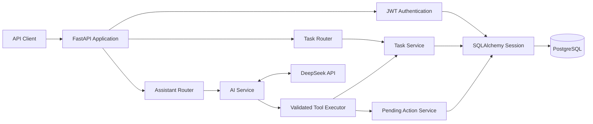

# task-cli

一个使用 FastAPI、PostgreSQL 和 DeepSeek Tool Calling 构建的多用户 AI 任务管理 API。

项目最初是命令行任务管理器，目前已经演进为 Web API。仓库名称继续保留为 `task-cli`，但正式应用入口是：

```text
task_cli.api:app
```

## Project Goal

这个项目用于学习并实践一个后端应用从简单 CRUD 到可部署 AI 应用的完整演进过程。

用户可以通过 REST API 管理自己的任务，也可以使用自然语言让 AI 查询、创建或修改任务。AI 不直接操作数据库，而是通过经过验证的工具调用进入现有业务层。

## Current Features

- 用户注册和密码登录
- JWT Bearer Authentication
- 不同用户之间的任务数据隔离
- 创建、查询、更新和删除任务
- 任务状态：`pending`、`doing`、`done`
- 任务优先级：`low`、`medium`、`high`
- 支持带时区的截止时间
- 按状态和优先级过滤
- `limit` 和 `offset` 分页
- DeepSeek Tool Calling
- AI 查询、创建和修改任务
- AI 删除任务前创建待确认操作
- PostgreSQL 数据持久化
- Alembic 数据库迁移
- pytest 自动化测试
- Docker Compose 本地运行环境
- pre-commit 本地检查
- GitHub Actions 持续集成

## Architecture



### Request Flow

普通任务请求：

```text
HTTP Request
→ FastAPI Router
→ JWT Authentication
→ Pydantic Schema Validation
→ Service
→ SQLAlchemy
→ PostgreSQL
→ Response Model
```

AI 请求：

```text
User Message
→ Assistant Router
→ AI Service
→ DeepSeek Tool Call
→ JSON Parsing
→ Pydantic Tool Argument Validation
→ Inject current_user.id
→ Existing Service
→ Database
→ Assistant Response
```

## Layer Responsibilities

| Layer                  | Responsibility                                 |
| ---------------------- | ---------------------------------------------- |
| Router                 | 接收 HTTP 请求、解析依赖、选择状态码和响应模型 |
| Authentication         | 解码 JWT，并从数据库确认当前用户仍然存在       |
| Schema                 | 验证 API 输入、输出以及 AI Tool 参数           |
| Service                | 执行业务规则和数据库事务                       |
| ORM Model              | 描述数据库表及其关系                           |
| AI Service             | 管理模型消息、Tool Call 和最大调用轮数         |
| AI Tools               | 验证模型参数，并把操作转交给现有 Service       |
| Pending Action Service | 管理危险操作的确认、取消和过期状态             |
| Alembic                | 管理 PostgreSQL 数据库结构变更                 |

## Security Boundaries

- 密码以哈希形式保存，不保存明文密码。
- JWT Payload 可以被读取，因此不得存放密码或 API Key。
- JWT 签名用于验证 Token 的真实性和完整性。
- 每个任务查询都使用 `current_user.id` 限制所有权。
- AI Tool 参数禁止额外字段。
- `owner_id` 不由模型提供，而是由认证用户身份注入。
- AI 请求删除任务时，不会立即删除，而是创建待确认操作。
- REST API 的 `DELETE /tasks/{task_id}` 当前仍然是立即删除。

最后一条差异必须明确记录：AI 删除有确认流程，但直接 REST 删除当前没有确认流程。

## Project Structure

```text
task-cli/
├── src/task_cli/
│   ├── api.py                  # FastAPI 应用入口
│   ├── routers/                # HTTP 路由层
│   ├── schemas.py              # Task API Schema
│   ├── schemas_user.py         # User Schema
│   ├── schemas_ai.py           # Assistant Schema
│   ├── models.py               # SQLAlchemy ORM Models
│   ├── services.py             # Task 业务逻辑
│   ├── user_service.py         # User 业务逻辑
│   ├── action_service.py       # 待确认操作业务逻辑
│   ├── auth.py                 # JWT 创建和解码
│   ├── auth_dependencies.py    # 当前登录用户依赖
│   ├── security.py             # 密码哈希和验证
│   ├── ai_service.py           # AI 对话和 Tool Call 流程
│   ├── ai_tools.py             # AI 工具定义与执行
│   ├── ai_provider.py          # DeepSeek Provider 调用
│   ├── database.py             # Engine 和 Session
│   └── config.py               # 环境配置
├── alembic/                    # 数据库迁移
├── tests/                      # 自动化测试
├── .github/workflows/ci.yml    # GitHub Actions CI
├── Dockerfile
├── docker-compose.yml
└── pyproject.toml
```

## Tech Stack

- Python 3.12
- FastAPI
- Pydantic
- SQLAlchemy
- PostgreSQL 16
- Alembic
- JWT Authentication
- DeepSeek API
- pytest
- Ruff
- mypy
- pre-commit
- GitHub Actions
- Docker Compose

## Environment Variables

复制 `.env.example` 创建本地 `.env`，但不要覆盖已经存在的 `.env`：

```powershell
if (-not (Test-Path .env)) {
    Copy-Item .env.example .env
}
```

| Variable                      | Purpose                   | Example                     |
| ----------------------------- | ------------------------- | --------------------------- |
| `POSTGRES_USER`               | PostgreSQL 用户名         | `task_user`                 |
| `POSTGRES_PASSWORD`           | PostgreSQL 密码           | `task_password`             |
| `POSTGRES_DB`                 | PostgreSQL 数据库名称     | `task_db`                   |
| `DATABASE_URL`                | SQLAlchemy 数据库连接地址 | `postgresql+psycopg2://...` |
| `LOG_LEVEL`                   | 应用日志级别              | `INFO`                      |
| `JWT_SECRET_KEY`              | JWT 签名密钥              | 使用随机长字符串            |
| `JWT_ALGORITHM`               | JWT 签名算法              | `HS256`                     |
| `ACCESS_TOKEN_EXPIRE_MINUTES` | Access Token 有效分钟数   | `30`                        |
| `DEEPSEEK_API_KEY`            | DeepSeek API Key          | 不要提交到 Git              |
| `DEEPSEEK_MODEL`              | DeepSeek 模型名称         | `deepseek-v4-flash`         |

生成 JWT Secret：

```powershell
python -c "import secrets; print(secrets.token_urlsafe(48))"
```

把输出结果手动写入 `.env` 的 `JWT_SECRET_KEY`。

`.env.example` 只描述项目需要哪些配置，可以提交到 Git；`.env` 保存本机密码和 API Key，不应该提交。

## Local Development

### 1. Create Virtual Environment

```powershell
python -m venv .venv
.venv\Scripts\Activate.ps1
```

### 2. Install Dependencies

```powershell
python -m pip install --upgrade pip
python -m pip install -e ".[dev]"
```

`.[dev]` 会在安装运行依赖的同时，安装 pytest、Ruff、mypy 和 pre-commit 等开发工具。

### 3. Start PostgreSQL

```powershell
docker compose up -d db
docker compose ps
```

等待 `task-postgres` 状态变为 `healthy`。

### 4. Upgrade Database

查看迁移链的最新版本：

```powershell
python -m alembic heads
```

应用所有尚未执行的迁移：

```powershell
python -m alembic upgrade head
```

确认数据库已经位于最新版本：

```powershell
python -m alembic current
```

Alembic 使用 `DATABASE_URL` 连接数据库。宿主机运行应用时，数据库地址使用：

```text
localhost:5432
```

### 5. Start API

```powershell
uvicorn task_cli.api:app --reload
```

应用地址：

```text
http://127.0.0.1:8000
```

Swagger API 文档：

```text
http://127.0.0.1:8000/docs
```

OpenAPI Schema：

```text
http://127.0.0.1:8000/openapi.json
```

## Docker Compose

同时构建并启动 PostgreSQL 和 API：

```powershell
docker compose up -d --build
```

查看容器状态：

```powershell
docker compose ps
```

查看 API 日志：

```powershell
docker compose logs api --tail 50
```

确认容器数据库迁移版本：

```powershell
docker compose exec api python -m alembic current
```

Docker Compose 中的 API 容器使用下面的数据库地址：

```text
db:5432
```

这里的 `db` 是 Compose Service 名称。容器中的 `localhost` 只表示容器自身，不能用于连接 PostgreSQL 容器。

API 容器启动时会依次执行：

```text
alembic upgrade head
→ uvicorn task_cli.api:app
```

停止服务：

```powershell
docker compose down
```

除非明确准备删除 PostgreSQL 数据，否则不要执行：

```powershell
docker compose down -v
```

`-v` 会一并删除保存数据库内容的 `postgres_data` Volume。

## API Endpoints

除根路径、注册和登录外，其余接口都需要：

```http
Authorization: Bearer <access_token>
```

| Method   | Path                                     | Authentication | Purpose                    |
| -------- | ---------------------------------------- | -------------- | -------------------------- |
| `GET`    | `/`                                      | No             | API 健康检查               |
| `POST`   | `/auth/register`                         | No             | 注册用户                   |
| `POST`   | `/auth/login`                            | No             | 登录并签发 JWT             |
| `POST`   | `/tasks/`                                | Yes            | 创建任务                   |
| `GET`    | `/tasks/`                                | Yes            | 查询当前用户的任务         |
| `GET`    | `/tasks/{task_id}`                       | Yes            | 查询当前用户的一项任务     |
| `PUT`    | `/tasks/{task_id}`                       | Yes            | 更新当前用户的一项任务     |
| `DELETE` | `/tasks/{task_id}`                       | Yes            | 立即删除当前用户的一项任务 |
| `POST`   | `/assistant/`                            | Yes            | 使用自然语言管理任务       |
| `POST`   | `/assistant/actions/{action_id}/confirm` | Yes            | 确认并执行待确认操作       |
| `POST`   | `/assistant/actions/{action_id}/cancel`  | Yes            | 取消待确认操作             |

### Task Query Parameters

`GET /tasks/` 支持：

| Parameter  | Type                       | Default | Description        |
| ---------- | -------------------------- | ------- | ------------------ |
| `status`   | `pending`, `doing`, `done` | None    | 按任务状态过滤     |
| `priority` | `low`, `medium`, `high`    | None    | 按优先级过滤       |
| `limit`    | Integer, `1..100`          | `20`    | 每次最多返回多少项 |
| `offset`   | Integer, `>= 0`            | `0`     | 跳过多少项         |

没有提供过滤条件时，会查询当前用户自己的全部任务，再应用分页。

## PowerShell API Example

以下示例假设 API 正在运行：

```text
http://127.0.0.1:8000
```

### 1. Register

```powershell
$registerBody = @{
    username = "alice"
    email = "alice@example.com"
    password = "password123"
} | ConvertTo-Json

Invoke-RestMethod `
    -Method Post `
    -Uri "http://127.0.0.1:8000/auth/register" `
    -ContentType "application/json" `
    -Body $registerBody
```

注册请求使用 JSON。成功时返回：

```json
{
  "id": 1,
  "username": "alice",
  "email": "alice@example.com"
}
```

返回内容不包含明文密码或密码哈希。

如果用户名或邮箱已经存在，接口返回 `409 Conflict`。重复运行示例时，可以更换用户名和邮箱。

### 2. Login

```powershell
$login = Invoke-RestMethod `
    -Method Post `
    -Uri "http://127.0.0.1:8000/auth/login" `
    -ContentType "application/x-www-form-urlencoded" `
    -Body @{
        username = "alice"
        password = "password123"
    }
```

登录使用 OAuth2 表单编码，不使用 JSON。

保存认证 Header：

```powershell
$headers = @{
    Authorization = "Bearer $($login.access_token)"
}
```

### 3. Create Task

```powershell
$taskBody = @{
    title = "完成 Day39"
    description = "完善项目文档"
    priority = "high"
    due_at = "2027-01-01T18:00:00+08:00"
} | ConvertTo-Json

$task = Invoke-RestMethod `
    -Method Post `
    -Uri "http://127.0.0.1:8000/tasks/" `
    -Headers $headers `
    -ContentType "application/json" `
    -Body $taskBody

$task
```

`due_at` 必须包含时区。例如：

```text
2027-01-01T18:00:00+08:00
```

没有时区的 `2027-01-01T18:00:00` 会被拒绝。

### 4. Query Tasks

查询当前用户的全部任务：

```powershell
Invoke-RestMethod `
    -Method Get `
    -Uri "http://127.0.0.1:8000/tasks/" `
    -Headers $headers
```

查询高优先级、进行中的任务：

```powershell
Invoke-RestMethod `
    -Method Get `
    -Uri "http://127.0.0.1:8000/tasks/?status=doing&priority=high&limit=20&offset=0" `
    -Headers $headers
```

过滤、所有权范围和分页都在数据库查询中完成，不是在 Python 中读取全部任务后再过滤。

### 5. Update Task

```powershell
$updateBody = @{
    status = "doing"
    priority = "high"
} | ConvertTo-Json

Invoke-RestMethod `
    -Method Put `
    -Uri "http://127.0.0.1:8000/tasks/$($task.id)" `
    -Headers $headers `
    -ContentType "application/json" `
    -Body $updateBody
```

更新请求只修改实际提供的字段。未提供的字段保持原值。

将 `due_at` 明确设置为 `null`，可以清除截止时间：

```powershell
$clearDueAtBody = @{
    due_at = $null
} | ConvertTo-Json
```

这里必须区分：

```text
没有提供 due_at → 不修改原截止时间
due_at = null    → 清除原截止时间
```

### 6. Use AI Assistant

```powershell
$assistantBody = @{
    message = "列出我的高优先级任务"
} | ConvertTo-Json

Invoke-RestMethod `
    -Method Post `
    -Uri "http://127.0.0.1:8000/assistant/" `
    -Headers $headers `
    -ContentType "application/json" `
    -Body $assistantBody
```

Assistant 接口返回：

```json
{
  "reply": "AI 根据真实任务数据生成的回答"
}
```

使用 Assistant 需要配置有效的 `DEEPSEEK_API_KEY`。Provider 不可用时，接口返回 `503 Service Unavailable`。

### 7. Confirm AI Delete Request

当 AI 请求删除任务时，任务不会被立即删除。Assistant 回复中会包含待确认操作 ID。

读取回复后，把实际操作 ID 保存为：

```powershell
$actionId = 1
```

确认删除：

```powershell
Invoke-RestMethod `
    -Method Post `
    -Uri "http://127.0.0.1:8000/assistant/actions/$actionId/confirm" `
    -Headers $headers
```

取消删除：

```powershell
Invoke-RestMethod `
    -Method Post `
    -Uri "http://127.0.0.1:8000/assistant/actions/$actionId/cancel" `
    -Headers $headers
```

只有待处理的操作可以被确认或取消：

- 已确认、已取消的操作再次处理时返回 `409 Conflict`；
- 已经过期的操作返回 `410 Gone`；
- 不存在或不属于当前用户的操作返回 `404 Not Found`。

## Tests

运行完整测试：

```powershell
python -m pytest -q
```

当前测试主要使用内存 SQLite，从而避免污染本地 PostgreSQL 数据库。但 SQLite 与 PostgreSQL 并不完全相同，因此 Docker/PostgreSQL 验证仍然有必要。

## Code Quality

运行当前配置范围内的 mypy：

```powershell
python -m mypy
```

安装 Git Hooks：

```powershell
python -m pre_commit install
python -m pre_commit install --hook-type pre-push
```

项目目前采用渐进式质量检查策略：

- pytest 运行完整测试集；
- mypy 检查 `pyproject.toml` 中指定的核心文件；
- CI 中的 Ruff 检查指定的核心文件；
- 完整仓库的 Ruff 和 mypy 覆盖仍在逐步扩展。

本地 Hook 可以被 `--no-verify` 跳过，因此 GitHub Actions 仍然是远程仓库的独立质量门禁。

## Known Limitations

- 当前没有前端界面，主要通过 Swagger UI 或 API Client 使用。
- Assistant 请求之间没有保存对话历史，每次 HTTP 请求都会重新创建消息列表。
- Assistant 返回的待确认操作 ID 位于自然语言 `reply` 中，没有独立的结构化字段。
- 项目没有向模型提供用户时区和服务器当前时间，因此不能可靠处理“明天下午三点”等相对时间。
- AI 删除任务需要确认，但直接调用 REST `DELETE` 接口会立即删除任务。
- 自动化测试主要使用 SQLite，尚未建立完整的 PostgreSQL 集成测试。
- DeepSeek Provider 尚未实现项目级重试、退避和 Token 使用量监控。
- Ruff 和 mypy 目前采用渐进式覆盖，尚未覆盖全部历史文件。
- 当前没有管理后台、密码重置、Refresh Token 或角色权限系统。

这些限制用于描述项目当前真实边界，不代表已有代码承诺了尚未实现的功能。

## Roadmap

后续开发继续采用产品问题驱动的方式，每次只解决一个明确问题。

### Near-term

- 返回结构化的 Assistant Action 信息
- 为相对日期提供明确的当前时间和时区上下文
- 增加 Assistant 对话历史
- 增加 PostgreSQL 集成测试
- 改善 AI Provider 错误处理、重试和可观测性
- 逐步扩大 Ruff 和 mypy 检查范围

### Possible Future Improvements

- Refresh Token 和安全登出
- 用户修改密码和密码重置
- 角色及权限控制
- 任务标签和排序
- 前端 Web 界面
- 部署到公开环境
- API 限流和生产级日志监控

Roadmap 只表示可能的演进方向，不表示这些功能已经实现。

## Development Status

当前项目已经完成从本地命令行程序到多用户 AI Web API 的主要演进：

```text
CLI
→ SQLAlchemy Persistence
→ FastAPI REST API
→ PostgreSQL and Alembic
→ JWT Authentication
→ User Data Isolation
→ DeepSeek Tool Calling
→ Confirmed Dangerous Actions
→ Automated Tests
→ Docker Compose
→ pre-commit and GitHub Actions
```
