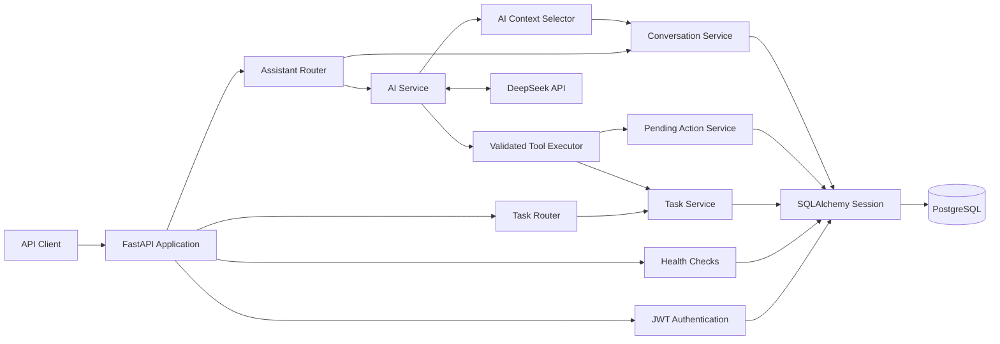

# task-cli

一个使用 FastAPI、PostgreSQL 和 DeepSeek Tool Calling 构建的多用户 AI 任务管理 API。

项目最初是命令行任务管理器，目前已经演进为 Web API。仓库名称继续保留为 `task-cli`，但正式应用入口是：

```text
task_cli.api:app
```

## Project Goal

这个项目用于学习并实践一个后端应用从简单 CRUD 到可部署 AI 应用的完整演进过程。

用户可以通过 REST API 管理自己的任务，也可以使用自然语言让 AI 查询、创建或修改任务。AI 不直接操作数据库，而是通过经过验证的工具调用进入现有业务层。

## Current Features

- 用户注册、密码哈希和 OAuth2 表单登录
- JWT Bearer Authentication
- JWT 密钥安全检查和用户身份二次查询
- 不同用户之间的任务数据隔离
- 创建、查询、更新和删除任务
- 任务状态：`pending`、`doing`、`done`
- 任务优先级：`low`、`medium`、`high`
- 支持带时区的截止时间
- 状态、优先级和逾期任务过滤
- 即将到期任务查询和截止时间排序
- `limit` 和 `offset` 分页
- DeepSeek Tool Calling
- AI 查询、创建和修改任务
- AI 删除任务前创建待确认操作
- AI Provider 超时、有限重试和错误分类
- AI 调用耗时和 Token 使用量日志
- 持久化 Conversation 和 Message
- 受预算限制的多轮对话上下文
- PostgreSQL 数据持久化
- Alembic 数据库迁移
- SQLite 快速测试和 PostgreSQL 集成测试
- Ruff 全仓库检查和完整源码 mypy 检查
- pre-commit 和 pre-push 本地检查
- GitHub Actions CI 配置
- Docker Compose 本地运行环境
- 非 root API 容器
- Liveness 和 Readiness 健康检查
- 数据库备份、恢复演练和发布检查手册

## Architecture



### Request Flow

普通任务请求：

```text
HTTP Request
→ FastAPI Router
→ JWT Authentication
→ Pydantic Schema Validation
→ Service
→ SQLAlchemy
→ PostgreSQL
→ Response Model
```

User Message
→ Assistant Router
→ JWT User Identity
→ Create or Load Owned Conversation
→ Load Limited Conversation History
→ Preserve Complete Tool Protocol Blocks
→ Apply Message and Estimated Token Budgets
→ DeepSeek Tool Call
→ JSON Parsing
→ Pydantic Tool Argument Validation
→ Inject current_user.id
→ Existing Service
→ PostgreSQL
→ Persist Message History
→ Assistant Response with conversation_id

## Layer Responsibilities

| Layer                  | Responsibility                                      |
| ---------------------- | --------------------------------------------------- |
| Router                 | 接收 HTTP 请求、解析依赖、选择状态码和响应模型      |
| Health Check           | 区分应用存活和数据库就绪状态                        |
| Authentication         | 解码 JWT，并从数据库确认当前用户仍然存在            |
| Schema                 | 验证 API 输入、输出以及 AI Tool 参数                |
| Service                | 执行业务规则和数据库事务                            |
| ORM Model              | 描述数据库表、关系和约束                            |
| Conversation Service   | 管理用户会话和持久化消息历史                        |
| AI Context             | 按消息数量、估算预算和 Tool 协议块选择历史          |
| AI Service             | 管理模型消息、Tool Call、持久化和最大调用轮数       |
| AI Provider            | 调用 DeepSeek，处理超时、重试、错误分类和使用量日志 |
| AI Tools               | 验证模型参数，并把操作转交给现有 Service            |
| Pending Action Service | 管理危险操作的确认、取消和过期状态                  |
| Alembic                | 管理 PostgreSQL 数据库结构变更                      |

## Security Boundaries

- 密码以哈希形式保存，不保存明文密码。
- JWT Payload 可以被读取，因此不得存放密码或 API Key。
- JWT 签名用于验证 Token 的真实性和完整性。
- 每个任务查询都使用 `current_user.id` 限制所有权。
- AI Tool 参数禁止额外字段。
- `owner_id` 不由模型提供，而是由认证用户身份注入。
- AI 请求删除任务时，不会立即删除，而是创建待确认操作。
- REST API 的 `DELETE /tasks/{task_id}` 当前仍然是立即删除。

最后一条差异必须明确记录：AI 删除有确认流程，但直接 REST 删除当前没有确认流程。

## Project Structure

task-cli/
├── src/task_cli/
│ ├── api.py # FastAPI 应用和健康检查
│ ├── routers/ # HTTP 路由层
│ ├── schemas.py # Task API Schema
│ ├── schemas_user.py # User Schema
│ ├── schemas_ai.py # Assistant 和 Conversation Schema
│ ├── models.py # SQLAlchemy ORM Models
│ ├── services.py # Task 业务逻辑
│ ├── user_service.py # User 业务逻辑
│ ├── conversation_service.py # 会话和消息持久化
│ ├── action_service.py # 待确认操作业务逻辑
│ ├── auth.py # JWT 创建、解码和密钥检查
│ ├── auth_dependencies.py # 当前登录用户依赖
│ ├── security.py # 密码哈希和验证
│ ├── ai_client.py # DeepSeek Client 配置
│ ├── ai_context.py # 历史上下文预算与协议块选择
│ ├── ai_service.py # AI 对话和 Tool Call 流程
│ ├── ai_tools.py # AI 工具定义与执行
│ ├── ai_provider.py # Provider 调用、错误分类和日志
│ ├── database.py # Engine 和 Session
│ └── config.py # 应用环境配置
├── alembic/ # 数据库迁移
├── tests/ # SQLite 和 PostgreSQL 测试
├── docs/operations.md # 运维、备份、恢复和发布手册
├── .github/workflows/ci.yml # GitHub Actions CI 配置
├── Dockerfile
├── docker-compose.yml
└── pyproject.toml

## Tech Stack

- Python 3.12
- FastAPI
- Pydantic
- SQLAlchemy
- PostgreSQL 16
- Alembic
- JWT Authentication
- DeepSeek API
- pytest
- Ruff
- mypy
- pre-commit
- GitHub Actions
- Docker Compose

## Environment Variables

复制 `.env.example` 创建本地 `.env`，但不要覆盖已经存在的 `.env`：

```powershell
if (-not (Test-Path .env)) {
    Copy-Item .env.example .env
}
```

| Variable                      | Purpose                       | Example                     |
| ----------------------------- | ----------------------------- | --------------------------- |
| `POSTGRES_USER`               | PostgreSQL 用户名             | `task_user`                 |
| `POSTGRES_PASSWORD`           | PostgreSQL 密码，必须显式配置 | 使用 URL-safe 随机字符串    |
| `POSTGRES_DB`                 | PostgreSQL 数据库名称         | `task_db`                   |
| `DATABASE_URL`                | 宿主机 SQLAlchemy 连接地址    | `postgresql+psycopg2://...` |
| `LOG_LEVEL`                   | 应用日志级别                  | `INFO`                      |
| `JWT_SECRET_KEY`              | JWT 签名密钥                  | 使用随机长字符串            |
| `JWT_ALGORITHM`               | JWT 签名算法                  | `HS256`                     |
| `ACCESS_TOKEN_EXPIRE_MINUTES` | Access Token 有效分钟数       | `30`                        |
| `DEEPSEEK_API_KEY`            | DeepSeek API Key              | 不要提交到 Git              |
| `DEEPSEEK_MODEL`              | DeepSeek 模型名称             | `deepseek-v4-flash`         |
| `DEEPSEEK_TIMEOUT_SECONDS`    | 单次 Provider 请求超时秒数    | `30`                        |
| `DEEPSEEK_MAX_RETRIES`        | SDK 自动重试次数，范围 0～5   | `2`                         |

生成 JWT Secret：

```powershell
python -c "import secrets; print(secrets.token_urlsafe(48))"
```

`.env.example` 中的密码和密钥是占位符，不能直接作为正式配置。

对于已经初始化的 PostgreSQL Volume，只修改 `.env` 不会自动修改数据库内部密码。密码轮换需要同步执行数据库用户密码变更，不能通过删除 Volume 完成。

把输出结果手动写入 `.env` 的 `JWT_SECRET_KEY`。

`.env.example` 只描述项目需要哪些配置，可以提交到 Git；`.env` 保存本机密码和 API Key，不应该提交。

## Local Development

### 1. Create Virtual Environment

```powershell
python -m venv .venv
.venv\Scripts\Activate.ps1
```

### 2. Install Dependencies

```powershell
python -m pip install --upgrade pip
python -m pip install -e ".[dev]"
```

`.[dev]` 会在安装运行依赖的同时，安装 pytest、Ruff、mypy 和 pre-commit 等开发工具。

### 3. Start PostgreSQL

```powershell
docker compose up -d db
docker compose ps
```

等待 `task-postgres` 状态变为 `healthy`。

### 4. Upgrade Database

查看迁移链的最新版本：

```powershell
python -m alembic heads
```

应用所有尚未执行的迁移：

```powershell
python -m alembic upgrade head
```

确认数据库已经位于最新版本：

```powershell
python -m alembic current
```

Alembic 使用 `DATABASE_URL` 连接数据库。宿主机运行应用时，数据库地址使用：

```text
localhost:5432
```

### 5. Start API

```powershell
uvicorn task_cli.api:app --reload
```

应用地址：

```text
http://127.0.0.1:8000
```

Swagger API 文档：

```text
http://127.0.0.1:8000/docs
```

OpenAPI Schema：

```text
http://127.0.0.1:8000/openapi.json
```

## Docker Compose

确认根目录 .env 已配置，并审核待应用迁移后，构建并启动 PostgreSQL、API 和前端。API 启动时会自动执行 alembic upgrade head；已有数据的环境应先备份。

```powershell
docker compose up -d --build
```

### 前端入口

启动后访问 http://localhost:8080/，不需要运行 Vite 开发服务器。

- Node 构建阶段生成 `dist`。
- 非 root Nginx 提供静态文件。
- 浏览器请求 `/api/...`，Nginx 去掉 `/api/` 前缀后转发到 `api:8000`。
- `VITE_API_BASE_URL=/api` 在构建时写入前端产物，不是 Nginx 运行时配置。
- 前端端口仅绑定 `127.0.0.1:8080`。现有 API 和数据库端口仍发布到宿主机，因此此配置不能直接视为完成公网安全加固。

通过前端入口检查后端就绪状态：

```powershell
Invoke-RestMethod http://localhost:8080/api/health/ready
```

前端容器健康仅表示页面入口可用，不代表 API 和数据库始终正常。

### 修改代码后更新容器

`docker compose start` 只启动已有容器，不会把修改后的源码装入容器。

更新 API 前先构建镜像，审核迁移，再重新创建 API 容器。API 容器地址可能变化，重建后应重启前端 Nginx，让它重新解析服务地址。

数据库迁移 head 一致，只说明迁移版本一致，不代表运行中的应用代码已经最新。

不要为了更新应用执行 `docker compose down -v`。

查看容器状态：

```powershell
docker compose ps
```

查看 API 日志：

```powershell
docker compose logs api --tail 50
```

确认容器数据库迁移版本：

```powershell
docker compose exec api python -m alembic current
```

Docker Compose 中的 API 容器使用下面的数据库地址：

```text
db:5432
```

这里的 `db` 是 Compose Service 名称。容器中的 `localhost` 只表示容器自身，不能用于连接 PostgreSQL 容器。

API 容器启动时会依次执行：

```text
alembic upgrade head
→ uvicorn task_cli.api:app
```

停止服务：

```powershell
docker compose down
```

除非明确准备删除 PostgreSQL 数据，否则不要执行：

```powershell
docker compose down -v
```

`-v` 会一并删除保存数据库内容的 `postgres_data` Volume。

## API Endpoints

除根路径、注册和登录外，其余接口都需要：

```http
Authorization: Bearer <access_token>
```

| Method   | Path                                                  | Authentication | Purpose                    |
| -------- | ----------------------------------------------------- | -------------- | -------------------------- |
| `GET`    | `/`                                                   | No             | 返回 API 运行信息          |
| `GET`    | `/health/live`                                        | No             | 检查 FastAPI 进程存活      |
| `GET`    | `/health/ready`                                       | No             | 检查 API 和数据库就绪      |
| `POST`   | `/auth/register`                                      | No             | 注册用户                   |
| `POST`   | `/auth/login`                                         | No             | 登录并签发 JWT             |
| `POST`   | `/tasks/`                                             | Yes            | 创建任务                   |
| `GET`    | `/tasks/`                                             | Yes            | 查询当前用户的任务         |
| `GET`    | `/tasks/{task_id}`                                    | Yes            | 查询当前用户的一项任务     |
| `PUT`    | `/tasks/{task_id}`                                    | Yes            | 更新当前用户的一项任务     |
| `DELETE` | `/tasks/{task_id}`                                    | Yes            | 立即删除当前用户的一项任务 |
| `POST`   | `/assistant/`                                         | Yes            | 开始或继续 AI 会话         |
| `GET`    | `/assistant/conversations`                            | Yes            | 查询当前用户的会话         |
| `GET`    | `/assistant/conversations/{conversation_id}/messages` | Yes            | 查询会话可见消息           |
| `POST`   | `/assistant/actions/{action_id}/confirm`              | Yes            | 确认并执行待确认操作       |
| `POST`   | `/assistant/actions/{action_id}/cancel`               | Yes            | 取消待确认操作             |

### Task Query Parameters

`GET /tasks/` 支持：

| Parameter         | Type                       | Default | Description                        |
| ----------------- | -------------------------- | ------- | ---------------------------------- |
| `status`          | `pending`, `doing`, `done` | None    | 按任务状态过滤                     |
| `priority`        | `low`, `medium`, `high`    | None    | 按优先级过滤                       |
| `overdue`         | Boolean                    | `false` | 查询截止时间已过且尚未完成的任务   |
| `due_within_days` | Integer, `1..365`          | None    | 查询指定天数内到期且尚未完成的任务 |
| `sort`            | `due_at`                   | None    | 按截止时间升序，空截止时间排在最后 |
| `limit`           | Integer, `1..100`          | `20`    | 每次最多返回多少项                 |
| `offset`          | Integer, `>= 0`            | `0`     | 跳过多少项                         |

所有权过滤、业务过滤、排序和分页都在 SQL 查询中完成。

逾期条件为：

```text
due_at < 当前 UTC 时间
AND status != done
```

即将到期条件为：

```text
当前 UTC 时间 <= due_at <= 当前时间 + due_within_days
AND status != done
```

`overdue=true` 与 `due_within_days` 表示互斥的时间范围，同时使用时通常得到空结果。

没有提供排序时按任务 `id` 排序；使用 `sort=due_at` 时，没有截止时间的任务排在最后，相同截止时间再按 `id` 排序。

## PowerShell API Example

### 1. Register

```powershell
$registerBody = @{
    username = "alice"
    email = "alice@example.com"
    password = "password123"
} | ConvertTo-Json

Invoke-RestMethod `
    -Method Post `
    -Uri "http://127.0.0.1:8000/auth/register" `
    -ContentType "application/json" `
    -Body $registerBody
```

注册请求使用 JSON。成功时返回：

```json
{
  "id": 1,
  "username": "alice",
  "email": "alice@example.com"
}
```

返回内容不包含明文密码或密码哈希。

如果用户名或邮箱已经存在，接口返回 `409 Conflict`。重复运行示例时，可以更换用户名和邮箱。

### 2. Login

```powershell
$login = Invoke-RestMethod `
    -Method Post `
    -Uri "http://127.0.0.1:8000/auth/login" `
    -ContentType "application/x-www-form-urlencoded" `
    -Body @{
        username = "alice"
        password = "password123"
    }
```

登录使用 OAuth2 表单编码，不使用 JSON。

保存认证 Header：

```powershell
$headers = @{
    Authorization = "Bearer $($login.access_token)"
}
```

### 3. Create Task

```powershell
$taskBody = @{
    title = "完成 Day39"
    description = "完善项目文档"
    priority = "high"
    due_at = "2027-01-01T18:00:00+08:00"
} | ConvertTo-Json

$task = Invoke-RestMethod `
    -Method Post `
    -Uri "http://127.0.0.1:8000/tasks/" `
    -Headers $headers `
    -ContentType "application/json" `
    -Body $taskBody

$task
```

`due_at` 必须包含时区。例如：

```text
2027-01-01T18:00:00+08:00
```

没有时区的 `2027-01-01T18:00:00` 会被拒绝。

### 4. Query Tasks

查询当前用户的全部任务：

```powershell
Invoke-RestMethod `
    -Method Get `
    -Uri "http://127.0.0.1:8000/tasks/" `
    -Headers $headers
```

查询高优先级、进行中的任务：

```powershell
Invoke-RestMethod `
    -Method Get `
    -Uri "http://127.0.0.1:8000/tasks/?status=doing&priority=high&limit=20&offset=0" `
    -Headers $headers
```

过滤、所有权范围和分页都在数据库查询中完成，不是在 Python 中读取全部任务后再过滤。

### 5. Update Task

```powershell
$updateBody = @{
    status = "doing"
    priority = "high"
} | ConvertTo-Json

Invoke-RestMethod `
    -Method Put `
    -Uri "http://127.0.0.1:8000/tasks/$($task.id)" `
    -Headers $headers `
    -ContentType "application/json" `
    -Body $updateBody
```

更新请求只修改实际提供的字段。未提供的字段保持原值。

将 `due_at` 明确设置为 `null`，可以清除截止时间：

```powershell
$clearDueAtBody = @{
    due_at = $null
} | ConvertTo-Json
```

这里必须区分：

```text
没有提供 due_at → 不修改原截止时间
due_at = null    → 清除原截止时间
```

### 6. Use AI Assistant

第一次请求不提供 `conversation_id`，服务器会创建当前用户的新会话：

```powershell
$assistantBody = @{
    message = "列出我的高优先级任务"
} | ConvertTo-Json

$assistant = Invoke-RestMethod `
    -Method Post `
    -Uri "http://127.0.0.1:8000/assistant/" `
    -Headers $headers `
    -ContentType "application/json" `
    -Body $assistantBody

$assistant
```

Assistant 返回：

```json
{
  "conversation_id": 1,
  "reply": "AI 根据真实任务数据生成的回答"
}
```

继续同一个会话时，把返回的 `conversation_id` 放入下一次请求：

```powershell
$continueBody = @{
    message = "只保留其中即将到期的任务"
    conversation_id = $assistant.conversation_id
} | ConvertTo-Json

Invoke-RestMethod `
    -Method Post `
    -Uri "http://127.0.0.1:8000/assistant/" `
    -Headers $headers `
    -ContentType "application/json" `
    -Body $continueBody
```

查询当前用户的会话：

```powershell
Invoke-RestMethod `
    -Method Get `
    -Uri "http://127.0.0.1:8000/assistant/conversations" `
    -Headers $headers
```

查询指定会话中用户可见的消息：

```powershell
Invoke-RestMethod `
    -Method Get `
    -Uri "http://127.0.0.1:8000/assistant/conversations/$($assistant.conversation_id)/messages" `
    -Headers $headers
```

消息接口只返回带文本内容的 `user` 和 `assistant` 消息，不暴露内部 Tool Call 与 Tool Result。

使用 Assistant 需要有效的 `DEEPSEEK_API_KEY`。Provider 不可用时返回 `503 Service Unavailable`。

### 7. Confirm AI Delete Request

当 AI 请求删除任务时，任务不会被立即删除。Assistant 回复中会包含待确认操作 ID。

读取回复后，把实际操作 ID 保存为：

```powershell
$actionId = 1
```

确认删除：

```powershell
Invoke-RestMethod `
    -Method Post `
    -Uri "http://127.0.0.1:8000/assistant/actions/$actionId/confirm" `
    -Headers $headers
```

取消删除：

```powershell
Invoke-RestMethod `
    -Method Post `
    -Uri "http://127.0.0.1:8000/assistant/actions/$actionId/cancel" `
    -Headers $headers
```

只有待处理的操作可以被确认或取消：

- 已确认、已取消的操作再次处理时返回 `409 Conflict`；
- 已经过期的操作返回 `410 Gone`；
- 不存在或不属于当前用户的操作返回 `404 Not Found`。

## Tests

运行默认测试：

```powershell
python -m pytest -q
```

默认业务测试使用内存 SQLite，以获得较快的速度和测试隔离。

PostgreSQL 集成测试只有在明确配置专用测试数据库时才运行：

```powershell
$env:TEST_POSTGRES_URL = "postgresql+psycopg2://<user>:<password>@localhost:5432/task_test"
python -m pytest tests/test_postgres_integration.py -q
```

`TEST_POSTGRES_URL` 的数据库名称必须包含 `test`，不能指向开发数据库或生产数据库。

PostgreSQL 集成测试验证：

- 连接的确是 PostgreSQL；
- 数据库 revision 等于代码 head；
- 真实数据库包含关键表；
- 关键外键和检查约束存在；
- PostgreSQL 返回带时区的当前时间。

## Code Quality

完整 Ruff 检查：

```powershell
ruff check .
ruff format --check .
```

完整源码 mypy 检查：

```powershell
python -m mypy
```

安装 Git Hooks：

```powershell
python -m pre_commit install
python -m pre_commit install --hook-type pre-push
```

手动运行所有 commit 阶段 Hook：

```powershell
python -m pre_commit run --all-files
```

手动运行 pre-push pytest：

```powershell
python -m pre_commit run pytest --hook-stage pre-push --all-files
```

本地 Hook 可以通过 `--no-verify` 跳过，因此远程 CI 仍然是独立质量门禁。

## Operations

启动、健康检查、迁移、备份、恢复和发布验收流程见：

```text
docs/operations.md
```

数据库备份必须保存在仓库外，不能提交到 Git。

## Known Limitations

- 已有 React 前端；任务列表目前最多查询 100 条，尚无分页控件。
- 当前 Assistant 响应包含结构化 pending_action；历史消息接口不恢复待确认操作卡片。
- 项目没有用户时区和可靠的相对时间解析，不能保证正确处理“明天下午三点”。
- AI 删除任务需要确认，但 REST `DELETE` 当前仍然立即删除。
- 会话上下文采用消息数和 UTF-8 字节估算预算，不是 DeepSeek 官方精确 Tokenizer。
- 当前没有 API 级限流。
- 当前没有 Refresh Token、安全登出、密码重置或角色权限系统。
- 当前没有集中式日志、指标和告警平台。
- Docker Compose 启动时自动迁移，只适合当前单实例。
- Python 依赖尚未使用完整 lock file 固定所有传递依赖。
- 当前没有公网托管平台、域名和 TLS。
- 已配置 Git remote；发布验收应查看对应提交的远程 CI 结果，本地测试通过不能替代远程验证。

## Roadmap

后续继续采用产品问题驱动的方式，每次只解决一个明确问题。

### Near-term

- 增加用户时区和受控的相对日期解析；
- 为 API 增加适度限流；
- 持续验证远程 CI”；
- 选择托管平台完成公网部署。

### Frontend Phase

当前已在 `frontend/` 实现 React + TypeScript 前端，包括：

- API Client 与运行时响应校验；
- 注册、登录和内存中的认证状态；
- 任务列表、状态与优先级筛选；
- 创建、编辑和删除交互；
- AI Assistant、删除确认卡片与会话历史；
- 时间显示、前端自动化测试和 Nginx 容器入口。

后续仍可完善分页、更多筛选与交互测试；公网部署另行决定。

### Future AI Project

RAG、文档解析、Embedding、pgvector 和异步任务不会全部塞进 task-cli。

这些能力更适合后续独立作品“智能文档工作台”，以保持 task-cli 的产品边界清晰。

## Development Status

当前项目已经完成以下演进：

```text
CLI Learning Project
→ SQLAlchemy Persistence
→ FastAPI REST API
→ PostgreSQL and Alembic
→ JWT Authentication
→ User Data Isolation
→ DeepSeek Tool Calling
→ Confirmed Dangerous Actions
→ Task Priority and Due Time
→ Overdue and Upcoming Queries
→ Persistent Conversation History
→ Controlled Context Window
→ AI Error Classification and Observability
→ Security Review
→ Full Ruff and mypy Coverage
→ PostgreSQL Integration Tests
→ Non-root Docker Release Candidate
→ Health Checks and Recovery Rehearsal
```

当前包版本为 `0.1.0`。

本地发布候选已经具备完整测试、数据库迁移、非 root 容器、健康检查和备份恢复流程。公网部署、远程 CI 和 GitHub Release 仍待完成，因此不能宣称已经完成生产上线。
